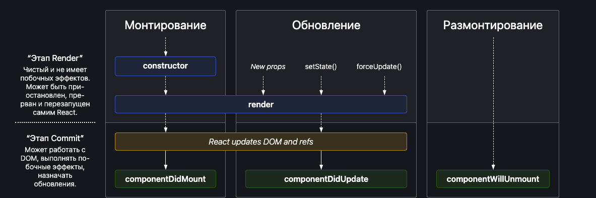

# Murad React ⚡️⚡️

# Parcel

- Dev Build
- Local Server
- HMR = Hot Module Replacement
- File Watching Algorithm - written in C++
- Caching - Faster Builds
- Image Optimization
- Minification
- Bundling
- Compress
- Consistent Hashing
- Code Splitting
- Differential Bundling - support older browsers
- Error Handling
- HTTPS
- Tree Shaking - remove unused code
- Different dev and prod bundles

# Murad Food

- Header
- - Logo
- - Nav Items
- Body
- - Search
- - Restaurant Container
- - RestaurantCard
- - Img
- - Name of Res, Star Rating, cuisines, delery tie
- Footer
- - Copyright
- - Links
- - Address
- - Contact

# React Hooks

(Normal JS utility functions)

- useState() - Super powerful State Variables in React
- useEffect() - Once the component has rendered and once the render loop has completed, the useEffect function will quickly call the callback function that we passed as an argument to the useEffect function.

# Request to API

- 1. Loads > API > Render
- 2. Loads > Render > API > Render (Best approach / Best UX)

# 2 types Routing in web apps

- Client Side Routing
- Server Side Routing

# Component Class

- Parent Constructor
- Parent Render
- Child Constructor
- Child Render
- secondChild Constructor
- secondChild Render
- Child Component Did Mount
- secondChild Component Did Mount
- Parent Component Did Mount

# ---- MOUNING ----

- Constructor (dummy - (фиктивные данные))
- Render (dummy)
  <HTML Dummy>
- Component Did Mount
  <API Call>
  <this.setState> => State Variable is updated

------ UPDATE

- Render(API data)
- HTML (new API data)
- Component Did Update

# Redux Toolkit

- Install @reduxjs/toolkit and react-redux
- Build our store
- Connect our store to our app
- Slice (cartSlice)
- Dispatch(action)
- Selector
